<!--
  rinz0x0cruz — GitHub profile README
  You found the source. Nicely done, operative.
  If you can read box-drawing characters and still sleep at night, we should talk.
-->

 

 
 

<em>I hunt vulnerabilities and take malware apart &mdash; then build small, sharp tools 
that turn raw threat data into something you can actually read. Deterministic-first, AI-optional.</em>

 

<h3 align="center"><code>rinzler@grid:~$ ls ./projects</code></h3>

| project | what it does | stack |
| :-- | :-- | :--: |
| **[exploitrank](https://github.com/rinz0x0cruz/exploitrank)** | Exploitability-aware CVE prioritizer &mdash; fuses CVSS · EPSS · CISA KEV · public-PoC signals into one SSVC-style verdict, with an offline dashboard. Key-free. | `Go` |
| **[Ikhor](https://github.com/rinz0x0cruz/Ikhor)** | Command-and-control framework &mdash; a custom async, multi-threaded agent for malware simulation and red-team task scheduling. | `C++` · `Qt` |
| **[learnscope](https://github.com/rinz0x0cruz/learnscope)** | Topic in &rarr; ranked learning-resource list out &mdash; a small aggregator over open web APIs. | `Python` |

  
  &nbsp;
  

<h3 align="center"><code>rinzler@grid:~$ git log --stat</code></h3>

  

  

<h3 align="center"><code>rinzler@grid:~$ cat ./contact.txt</code></h3>

  
  
  
  

 

  

