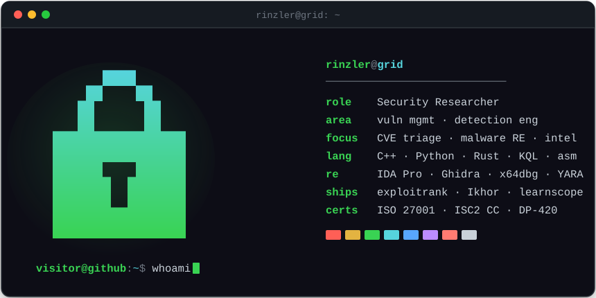

  

  
<strong>Security researcher and reverse engineer.</strong> 
  I build deterministic-first tools that turn security evidence into reviewable decisions.

  

    <a href="https://rinz0x0cruz.github.io/">Portfolio</a> |
    <a href="https://rinz0x0cruz.github.io/blog/">Field notes</a> |
    <a href="https://www.linkedin.com/in/rinz0x0cruz/">LinkedIn</a> |
    <a href="mailto:rinz0x0cruz@gmail.com">Email</a>
  

## Selected work

### ExploitRank

A fixed 5% EPSS review budget that keeps forecasts, recent exploitation, and known
use as distinct evidence states.

[Live dashboard](https://rinz0x0cruz.github.io/exploitrank/) |
[Case study](https://rinz0x0cruz.github.io/blog/fixed-budget-vulnerability-triage/) |
[Public artifacts](https://github.com/rinz0x0cruz/exploitrank)

### Malscope Dashboard

A public malware-analysis surface built from redacted, defanged report manifests,
correlations, and detections.

[Live dashboard](https://rinz0x0cruz.github.io/malscope-dashboard/) |
[Case study](https://rinz0x0cruz.github.io/blog/publishing-malware-analysis-evidence/) |
[Source](https://github.com/rinz0x0cruz/malscope-dashboard)

### Jobscope

Transparent job matching over reviewed ATS feeds, with deterministic scam checks and
human-controlled application preparation.

[Source and offline quick start](https://github.com/rinz0x0cruz/jobscope)

### Quorum

Reproducible comparisons of model-deliberation strategies using versioned task packs,
deterministic grading, and an offline mock provider.

[Source and benchmark guide](https://github.com/rinz0x0cruz/quorum)

## Working principles

- Keep the core deterministic and usable without model or API access.
- Preserve the meaning and limitations of each evidence source.
- Publish inspectable artifacts while keeping private data and implementation behind explicit boundaries.
- Treat accessibility, tests, delivery verification, and recovery as part of the work.

The portfolio contains the broader project record, verified outcomes, certifications, and technical writing: <https://rinz0x0cruz.github.io/>.

